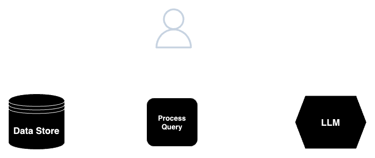
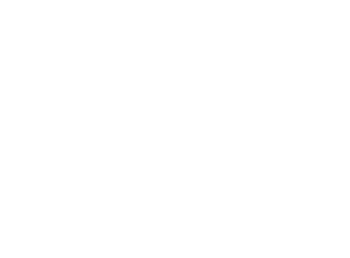

# Retrieval Augmented Generation (RAG) Patterns and Uses 

## Introduction to RAG

#### Overview

Retrieval Augmented Generation (RAG) is an approach that enhances the capabilities of large language models. Instead of relying solely on their pre-training data, LLMs can access external information sources to answer questions and generate text. This allows the to provide more accurate, up-to-date, and contextually relevant responses. This reduces the risk of hallucinating and prevents reliance on expensive model training flows. 

#### How RAG Works
RAG enhances language model responses by incorporating relevant information from external sources. When a user poses a question or request, RAG first searches a knowledge base (like a collection of documents) using the semantic meaning of the query. This search identifies the most relevant documents, which are then retrieved. The original query and retrieved documents are passed to the language model via a Prompt. The model then processes this combined information to generate a response that is informed by both its internal knowledge and the relevant external context. This approach allows the LLM to produce more accurate, up-to-date, and comprehensive answers compared to models relying solely on their pre-training data.



**Example Prompt:**

```
Given the context below context inside <context></context> tags,
respond to the user's query inside <query></query> tags. Use the context and 
not prior knowledge to answer the query. If the query cannot be answered 
with the context provided, respond with "No relevant information found". 

<context>{Vector Retrieved Context}</context>

<query>{Query input by user}</query>

Answer: 

```

Try the above prompt out by giving it your own context. Below is an example you can use and try out on a capable model: 

*Example Context*: The sky is blue when there are no clouds. Sometimes there are puffy clouds that block the sun. When it rains, the clouds are gray. At night everything is black.

*Example Prompt*: What color is the sky at night? (Answer should be black)
*Example Prompt*: What color is the sky in the summer? (Answer should be no relevant information found)

#### Core Concepts: Embeddings & Vectors
To support RAG systems, it is common to use Vector Searches to find the most related information or data from a data store. A vector search is different than a keyword search. A keyword search is looking for words that match the query where as a vector search is looking for results that match the semantic meaning of the query.  To support a vector search, supporting data(databases, documents, images, etc) from a data store need to go through a process known as embedding to map the data based on its semantic meaning. This then allows for a prompt or a query to pull relevant information based on the meaning of the query not just the words used. 

##### What are Vectors and Embeddings
Embeddings and vectors are essentially two sides of the same coin. In many cases, you will hear people use them interchangeably, but they do have subtle differences in meaning. Embeddings are numerical representations of words, phrases, or even entire documents, capturing their meaning and relationships. These embeddings are represented as vectors, which are simply lists of numbers. So, while embeddings capture the semantic essence, vectors are the mathematical form used to store and process that meaning.  


##### Example
In the example below, the words Movie, Musician, and Music are mapped in a vector space. As you can see, the words Music and Musician are physically located closer to one another than Movie. This is because their semantic meaning is closer in relationship. However, you can see that the User query is closer to Movie, than the rest and as a result Movie would be returned in a Vector search. 



There are multiple ways to measure the relationship between vectors and their use case can largely be dependent upon the embedding process. The most popular are dot products, L1, L2, and Cosine Similarity. 

## RAG Approaches and Architectures 

#### Overview 
Implementing a RAG solution requires careful consideration of various components to ensure optimal performance and relevance. Whether opting for a fully managed service, building a custom solution, or blending both, understanding the key aspects is crucial. The embedding process, which converts text into numerical representations, plays a vital role in how information is stored and retrieved. Selecting the right vector database is essential for efficient storage and retrieval of these embeddings. The vector search mechanism determines how quickly and accurately relevant information is located within the database.

Prompting strategies dictate how effectively the RAG system interacts with the Large Language Model, shaping the quality of generated responses. The choice of LLM itself is crucial, as different models offer varying capabilities and strengths. By evaluating each of these components, organizations can make informed decisions about which parts of the RAG system to build in-house or outsource to managed services, striking the right balance between customization, control, and ease of deployment.

#### Potential Approaches:

##### Managed Services: Convenience and Scalability
Managed RAG services are a compelling option for organizations seeking a fast and efficient path to implementing RAG on their own data. The major cloud service providers offer a full suite of tools and infrastructure, for the key components of the RAG pipeline.

***Managed Vector Search:*** A managed vector search service eliminates the need to build and maintain a complex vector database. It offers a scalable and optimized solution for storing and retrieving embeddings, ensuring rapid access to relevant information within vast knowledge bases.

***Managed LLM:*** Managed LLM services provide access to large language models of all types and purposes. This allows for quick and easy integration of powerful language generation capabilities into applications and backing them with your own data.

Leveraging managed RAG services offers several advantages, including:

- Reduced Time-to-Market: With pre-trained models and infrastructure, organizations can quickly deploy RAG solutions without extensive development cycles.
- Scalability: Managed services can easily scale to accommodate growing data volumes and user demands.
- Expertise: Service providers often have deep expertise in AI and can offer support and guidance throughout the implementation process.
- Cost-Effectiveness: Managed services can be more cost-effective than building and maintaining a custom RAG solution in-house, especially for smaller organizations or those with limited resources.

For more details on the managed services that the major cloud providers offer, see [Managed Tools and Services ](#Managed-Tools-and-Services) below. 

##### Custom Solution: Flexibility and Control
A fully custom Retrieval Augmented Generation (RAG) solution offers a tailored approach, meeting specific organizational needs with flexibility and adaptability for unique features and integrations. Enhanced control and ownership ensure data privacy, while optimized performance and scalability cater to large-scale applications. Although initial investment may be higher, long-term cost savings are possible due to reduced licensing fees and better resource utilization. Custom RAG solutions provide a competitive advantage through unique features and superior performance, fostering innovation and research opportunities for the organization.

A fully custom approach could mean deploying your own Vector Database that you access via your own services and compute. Additionally, a fully custom approach could also mean the use of your own LLM(custom or open source) that you deploy and manage. 

##### Hybrid Architecture: Managed Services and Custom
A hybrid architecture, combining the best of both worlds, can offer a compelling solution for organizations trying to strike a balance between long-term and short-term investments. By utilizing SaaS RAG services for core functionalities like retrieval and basic generation, businesses can benefit from rapid deployment, scalability, and pre-built integrations.  This approach enables organizations to quickly realize the benefits of RAG while maintaining some flexibility and cost savings. 

This could look like packaging together SaaS Vector search with a custom or open source LLM that you deploy and manage, or alternatively a custom Vector Search and process that you mix with a larger Managed LLM service.  

#### Choosing an Architecture
When implementing RAG, it's important to consider factors such as data quality, model selection, and evaluation metrics. Regular monitoring and updating of the knowledge base are also crucial to ensure the RAG system remains accurate and relevant. This of course needs to then be balanced with the costs to manage and/or run these services. 

Managed services offer convenience and scalability, but may be limited in terms of customization and cost. Custom solutions provide greater flexibility and control, but require more technical expertise and development time. The choice between them depends on your specific requirements, resources, and priorities.

Open Source tools such as [LlamaIndex](https://docs.llamaindex.ai/en/stable/), provide pre-built frameworks and resources for building and managing RAG and other LLM services of all types. These tools offer the ability to plug and play SaaS products and custom managed products at all steps of the process, while providing you a structure and guardrails to work in. 


## Quick RAG PoCs & Alternatives
There are many cases when you need features that RAG offers but without the need for a full product ready to be take to production. Depending on your needs and use case you may not need to write any code in order to try out some basic RAG functionality for your use case. 

Note, its important to remember that while the below options offer great functionality for little to no cost, nothing is free. Keep in mind privacy policies for each option and be sure you do not upload anything sensitive or private in nature. 


### RAG Proof of Concepts with Model Control
At times you may need to build out a proof of concept leveraging Cloud Technologies quickly that also offer a pathway to production or allow you to leverage production level data. Below are three options that offer quick set up time while still allowing you to provide your own data and model control in a chat interface. Additionally, each of these services make it easy to take your work form PoC to Production should you choose to do so. 

[Vertex AI Agents & Data Agents](https://cloud.google.com/dialogflow/vertex/docs/concept/data-store-agent): With agents offered by Vertex AI you can quickly create an Agent that has access to a datastore that you define. This could be from a website, storage bucket, unstructured data, structured data through BigQuery, or even a manual upload of a Vector Database. You can then quickly and easily test your agent and how it performs in augmenting its responses with your data. 

[OpenAI Agent Playground](https://platform.openai.com/playground/assistants): With OpenAI Agents you can easily create an Agent application in the playground space and enable File Search. From here you can upload your own Vector Database or an assortment of files and images to be used. You can then quickly and easily test your agent and how it performs in augmenting its responses with your data.  

[AWS Bedrock Studio](https://aws.amazon.com/blogs/aws/build-generative-ai-applications-with-amazon-bedrock-studio-preview/): With Bedrock Studio you can quickly create an application where you choose the model and temperature settings. After which you are then able to create you own Knowledge Base of various file types up to 50 files at 50Mb each. You can then quickly and easily test your application and how it performs in augmenting its responses with your data.

### RAG Capabilities without Code or AI Knowledge

[NotebookLM](https://notebooklm.google.com/): an AI-powered notebook that allows you to ground your work in your own notes and documents. It uses a RAG based approach to access and incorporate information from your Google Drive and manually uploaded files. This enables NotebookLM to generate summaries, answer questions, and even brainstorm ideas based on the information you've already stored. 

Document Upload (ChatGPT, Gemini, etc): Most LLM Services such as Gemini and ChatGPT offer the ability to upload and analyze documents that you upload with a prompt. You then have the ability to ask questions, pull details, and more from the document you uploaded. Note, that the document you upload in combination with your prompt are subject to token maximums. 
 

## Managed Tools and Services  

#### Cloud Agnostic Services 
While there are many open source Vector Databases(Ex: Chroma, Milvus) and LLMs(Ex: Llama, Gemma) that can be deployed various Cloud Providers, below we highlight ones that are managed services that can be found and used across one or more Cloud Providers: 

##### Vector Search/DB

[Pinecone](https://www.pinecone.io/): A serverless vector database that allows you to deliver Generative AI applications faster and at a reduced cost and is available on all Cloud Providers. 

[Astra DB](https://www.datastax.com/products/datastax-astra): A NoSQL and Vector database for Generative AI, offered by DataStax. It is built on Cassandra and advertised for its scalability and ease of use.

[Databricks](https://docs.databricks.com/en/generative-ai/vector-search.html): A vector database built into the Databricks Data Intelligence Platform. It is integrated with Databricks’ governance and productivity tools.

[pgvector](https://github.com/pgvector/pgvector): An open-source vector similarity search extension for Postgres. It allows you to store and query vectors alongside your data in Postgres. While this is not a managed service itself, it is a popular add-on to the commonly used PostgresDB and all major cloud providers support pgvector on their PostgresDB services. 


Larger Vector DB/Search Tools & Services can be found [here](https://docs.llamaindex.ai/en/stable/module_guides/storing/vector_stores/#vector-store-options-feature-support).

##### LLM Services

[Cohere](https://cohere.com/): A platform designed to work across multiple cloud providers, allowing you to deploy and manage your LLM applications in the environment that best suits your needs. They focus on providing enterprise-grade solutions for natural language processing tasks.

[Anthropic](https://www.anthropic.com/api): offers Claude, an LLM available through API and a user-friendly chat interface, designed for a wide range of tasks including text generation, summarization, and question-answering, while prioritizing safety and ethical considerations.

#### AWS

##### Vector Search/DB
[Open Search](https://docs.aws.amazon.com/opensearch-service/latest/developerguide/knn.html): A managed service that makes it easy to deploy, operate, and scale OpenSearch clusters in the AWS Cloud. It provides a fully managed k-NN (k-Nearest Neighbor) plugin, offering an efficient and scalable way to perform vector searches, making it ideal for use cases like image similarity search, recommendation engines, and anomaly detection.


##### LLM Services
[Amazon Bedrock](https://aws.amazon.com/bedrock/): A fully managed service that provides access to foundation models from leading AI providers, including Amazon and Anthropic, through an API. This simplifies the process of building and scaling generative AI applications

#### GCP

##### Vector Search/DB
[Vertex Search](https://cloud.google.com/vertex-ai/docs/vector-search/overview): Vertex AI Vector Search is a fully-managed vector database service based on Google's Scalable Nearest Neighbor Search (ScaNN) technology.


##### LLM Services
[Vertex AI](https://cloud.google.com/vertex-ai?hl=en): A comprehensive suite of LLM services for developers and businesses. It provides access to powerful foundation models like PaLM and Gemini for text and image generation, as well as Model Garden for exploring and deploying various pre-trained and open sourced models. 

#### Azure 

##### Vector Search/DB 
[Azure AI Search](https://azure.microsoft.com/en-us/products/ai-services/ai-search): Offers vector search capabilities that allow you to index, store, and retrieve vector embeddings, enabling similarity searches and recommendation engines. It utilizes a nearest neighbors algorithm to co-locate similar vectors, allowing for efficient retrieval of relevant information.

##### LLM Services
[Azure AI](https://azure.microsoft.com/en-us/products/ai-studio): offers OpenAI Service, providing access to powerful large language models from OpenAI for a variety of natural language processing tasks. Developers can integrate these models into their applications using Azure's robust infrastructure and tools.

## Custom Architecture Details
Azure: https://learn.microsoft.com/en-us/azure/architecture/ai-ml/guide/rag/rag-solution-design-and-evaluation-guide

GCP: https://cloud.google.com/blog/products/ai-machine-learning/rag-quickstart-with-ray-langchain-and-huggingface

AWS: https://aws.amazon.com/solutions/guidance/conversational-chatbots-using-retrieval-augmented-generation-on-aws/
